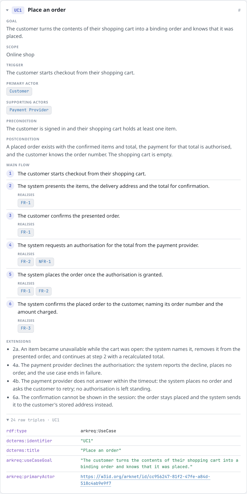

# arknet -- Architecture Knowledge Net

DDD architecture models that machines can understand.

W3C standards (RDF/OWL) instead of a proprietary DSL -- validatable (SHACL),
queryable (SPARQL), AI-ready (MCP).

This is what a use case looks like once it is in the store -- rendered by
`store_overview`'s self-contained HTML report, not hand-written:

<picture>
  <source media="(prefers-color-scheme: dark)" srcset="docs/img/use-case-card-dark.png">
  
</picture>

## Repository

Code and pull requests live on GitHub
([`github.com/kogn-io/arknet`](https://github.com/kogn-io/arknet)). Bugs and
feature requests go to the
[issue tracker](https://github.com/kogn-io/arknet/issues); open-ended
questions go to
[GitHub Discussions](https://github.com/kogn-io/arknet/discussions).

## Requirements

- Java 25+
- Maven 3.9+

## MCP Server

The arknet MCP server exposes the model as tools over the Model Context
Protocol. To use it from Claude Code together with the maintained skills
(`/arknet:adr`, `/arknet:req-interview`), install the
[`kogn-io/arknet-plugin`](https://github.com/kogn-io/arknet-plugin) plugin --
this repository builds and ships only the server itself.

### Prerequisite: start the MCP server daemon

The arknet MCP server is a single, long-lived process that serves **all** arknet
projects on the machine over Streamable HTTP at `127.0.0.1:47331` -- it is
**not** a subprocess that Claude Code starts. An HTTP entry in `.mcp.json` is
purely passive in Claude Code: it only connects to the URL, it does not start or
manage anything. So you start the daemon yourself once before first use. There
are three ways, all of them Docker: arknet exists only as a server, run locally
or on the network.

#### Option A: pre-built image from GHCR (recommended)

Every push to `main` publishes the daemon image, so nothing has to be built
locally:

```bash
docker run --rm -d --name arknet-mcp \
  -p 127.0.0.1:47331:47331 \
  -v ~/.arknet/rdf:/data/rdf \
  -v ~/.arknet/report:/data/report \
  -e ARKNET_REPORT_HOST_DIR=$HOME/.arknet/report \
  -v ~/.arknet/export:/data/export \
  -e ARKNET_EXPORT_HOST_DIR=$HOME/.arknet/export \
  ghcr.io/kogn-io/arknet:latest
```

Read the note under Option B on why the port publish must stay bound to
`127.0.0.1` and what `ARKNET_REPORT_HOST_DIR`/`ARKNET_EXPORT_HOST_DIR` are for
-- both apply here just the same.

#### Option B: Docker, built from source

Build the image from the repo root -- the build context MUST be the repo root,
because `arknet-mcp` is a multi-module reactor and needs its neighbouring
modules:

```bash
docker build -f arknet-mcp/Dockerfile -t arknet-mcp .
docker run --rm -d --name arknet-mcp \
  -p 127.0.0.1:47331:47331 \
  -v ~/.arknet/rdf:/data/rdf \
  -v ~/.arknet/report:/data/report \
  -e ARKNET_REPORT_HOST_DIR=$HOME/.arknet/report \
  -v ~/.arknet/export:/data/export \
  -e ARKNET_EXPORT_HOST_DIR=$HOME/.arknet/export \
  arknet-mcp
```

The `-p 127.0.0.1:47331:47331` is **deliberate, do not simplify it**: inside the
container the server binds to `0.0.0.0` (via the `SERVER_ADDRESS` env in the
image), because Docker's port-publish NAT delivers inbound connections to the
container's `eth0`, not to loopback -- a plain `127.0.0.1` bind would be
unreachable from outside. That moves the trust boundary to the **host side**: the
publish MUST explicitly bind to host loopback (`127.0.0.1:47331:47331`). A bare
`-p 47331:47331` would expose the **unauthenticated** daemon to the whole LAN
(ADR-009). The first volume holds the store itself (`~/.arknet/rdf`,
`arknet.rdf.storage`), so the model survives container restarts. The second
volume (`arknet.report.dir`) is where `store_overview` writes its self-contained
HTML report -- without it, the report has nowhere to go and its write fails.
`ARKNET_REPORT_HOST_DIR` must name the same path as that volume's host side
(`arknet.report.host-dir`): the container cannot discover its own bind mount's
host-side path on its own, so without this the digest's `# HTML report: ...`
line would name the container-internal `/data/report`, which the calling
agent -- running outside the container -- cannot reach (issue #160). The third
volume (`arknet.export.dir`) is where `project_export` writes its backups --
without it, the fallback export dir defaults to the container's root
filesystem and every `project_export` call fails with an
`AccessDeniedException`. `ARKNET_EXPORT_HOST_DIR` (`arknet.export.host-dir`)
mirrors `ARKNET_REPORT_HOST_DIR` for the same reason.

The container adopts that volume's existing owner automatically at startup (a
fresh, container-only volume falls back to the image's own non-root user) --
no host-side `chown`/`chmod` needed, even when reusing a directory an earlier
run already wrote to. Set `PUID`/`PGID` (`-e PUID=... -e PGID=...`)
only if you want to force a specific uid:gid regardless of what currently owns
the volume.

#### Option C: Docker Compose

Wires up the port publish (host loopback) and volume mount for you:

```bash
docker compose up --build
```

As long as the process runs, any number of Claude Code sessions (including
parallel worktrees of the same project) can share the same store without
blocking each other on the NativeStore directory lock. If the daemon is not
running, Claude Code reports the MCP connection as failed.

### Register your project

Which project a call hits is decided by an **anchor**: an opaque string your
client presents and the server looks up. `.mcp.json` sends the directory the
Claude Code session was started from, in the header
`X-Arknet-Project-Anchor: ${PWD}`. So **start Claude Code from the project
directory** -- `${PWD}` carries environment-variable semantics, not a dynamic
working directory.

The server never interprets that value: it does not shorten it, parse it, or
guess. An anchor nobody registered is an error, not a route to a default
project. Register once per project, from its directory:

```
project_add(label: "my-project")
```

Working on the same project from a second directory -- a git worktree, another
checkout -- start Claude Code there and attach it:

```
project_attach_anchor(anchor: "/path/to/the/worktree")
```

If you used arknet before projects were registered, your data sits in a dataset
named after the old derived id. `project_list` shows those under "unregistered
datasets"; claim one from the directory it belongs to, and it keeps its data:

```
project_adopt(datasetId: "my-project", label: "my-project")
```

A client that cannot set headers can pass the anchor to any tool instead, via
its optional `projectAnchor` parameter. The header stays the primary path: an
anchor supplied as a tool argument comes from the language model, and a guessed
one that happens to exist would silently hit the wrong project.

The header is not authentication, only project routing at a loopback /
single-user boundary (ADR-009). Because the project comes per call from the
anchor, all projects share this one port without collision.

### MCP tools

Requirements BC (`arknet-requirements`) -- requirement lifecycle:

| Tool | Description |
|------|-------------|
| `req_add` | Create a requirement (functional / non-functional) |
| `req_list` | List all managed requirements |
| `req_get` | Fetch a single requirement by identity (e.g. FR-1, NFR-7) |
| `req_set_status` | Change lifecycle status (PROPOSED / ACCEPTED) |
| `req_link_term` | Link a requirement to a glossary term (`arkreq:usesTerm`; the term must exist) |
| `req_update` | Correct a requirement's title, description, acceptance criteria and/or MoSCoW priority (each optional, unchanged if omitted) |
| `req_schema` | The `arkreq:` vocabulary (RequirementType, RequirementStatus, Priority) as data -- definition + allowed values, so a client need not guess |

Ubiquitous Language BC -- glossary terms (SKOS Concepts):

| Tool | Description |
|------|-------------|
| `term_add` | Create a new glossary term (mints a SKOS Concept; optionally markable as an actor via `actorKind`/`actorRole`) |
| `term_update` | Correct a term's preferred label, definition and/or actor facette, keeping its identity (and all links into it) unchanged (each argument optional, unchanged if omitted) |
| `term_list` | List all glossary terms |
| `term_get` | Fetch a single term by identity (e.g. TERM-1) |

Use Cases BC (`arknet-use-cases`) -- flow-oriented Cockburn use cases (bind FRs via an interaction flow):

| Tool | Description |
|------|-------------|
| `uc_add` | Create a complete use case in one call (goal, actor, trigger, numbered step flow with FR references) |
| `uc_list` | List all use cases |
| `uc_get` | Fetch a single use case with resolved steps and FR/actor edges (e.g. UC1) |
| `uc_update` | Correct a use case's title, goal, scope, trigger, precondition, postcondition and/or extensions (each optional, unchanged if omitted), and/or the text of individual existing steps by position -- does not touch primaryActor, supportingActors, the step list's structure or realises links |

Bounded Context BC (`arknet-bounded-context`) -- BoundedContext lifecycle (assigns glossary terms to a domain cut):

| Tool | Description |
|------|-------------|
| `bc_add` | Create a new bounded context |
| `bc_list` | List all bounded contexts |
| `bc_get` | Fetch a single bounded context with its linked glossary terms |
| `bc_link_term` | Link a bounded context to a glossary term (`arkddd:ubiquitousLanguageTerm`; the term must exist) |

ADR BC (`arknet-adr`) -- architecture decision records, store-backed and numbered independently of the hand-written markdown records under `docs/adr/`:

| Tool | Description |
|------|-------------|
| `adr_add` | Record a new decision in one call (title, context, decision, optional consequences, considered options and decision date, plus the requirement codes it addresses and the bounded-context codes it affects; each referenced resource must already exist). Starts out PROPOSED |
| `adr_list` | List all decisions, one compact line each |
| `adr_get` | Fetch a single decision with its full text and both directions of the supersedes relation (e.g. ADR-1) |
| `adr_set_status` | Change a decision's lifecycle status: PROPOSED -> ACCEPTED, PROPOSED -> REJECTED, or ACCEPTED -> DEPRECATED |
| `adr_supersede` | Record that one decision replaces an older one (`arkarch:supersedes`). Only the forward edge is stored -- the superseded decision reports it as "superseded by" from a reverse read, not from a second triple |

Project BC (`arknet-project`) -- the project registry: which anchor a call arrives with belongs to which project ([ADR-016](docs/adr/adr-016-projekt-identitaet-ueber-registrierte-anker.md)). An anchor is an opaque, typed string (`path`, `url`, `uuid`) the client sends and the server only ever looks up -- never parses, never derives an identity from. One project holds several anchors (a git worktree, a second checkout); one anchor belongs to exactly one project. Unlike every other bounded context, these tools are not scoped to one project -- their registry is what answers the routing question:

| Tool | Description |
|------|-------------|
| `project_add` | Register a project; the calling client's origin directory becomes its first anchor (or pass `anchor`/`anchorType` explicitly for clients that cannot supply one) |
| `project_adopt` | Claim an existing dataset as the project the call comes from -- for data written before projects were registered, or a dataset restored from a backup; the dataset keeps its identity and all its data |
| `project_attach_anchor` | Attach a further anchor to the project the call comes from -- for the same project worked on from a second directory (`callerAnchor` names the calling project explicitly when the transport carries no origin directory) |
| `project_rename` | Rename the project the call comes from; identity and anchors are unaffected (same optional `callerAnchor`) |
| `project_list` | List all registered projects with their anchors and identities, plus any datasets no project claims yet (adoptable with `project_adopt`) |

Store report -- generic, cross-BC read path (readOnly; works for any BC without type mapping):

| Tool | Description |
|------|-------------|
| `store_overview` | Compact text digest of the project store (prefix legend, type counts, entity rows with `resource_get` drill-down, integrity hint) + writes a self-contained HTML report and returns its path. The report reads as the model rather than as triples -- use cases with their numbered flow, requirements with their acceptance criteria, glossary, bounded contexts -- and keeps a raw section for everything no bounded context claims, so nothing in the store can hide from it. References show the term itself rather than its running number, and requirement and bounded-context prose is marked up against the glossary: a mention the model links to becomes a link, a mention of a glossary term with no such link is flagged as a gap -- the link is only ever created by an explicit `req_link_term`/`bc_link_term` call, so text and model drift apart by default |
| `resource_get` | The model triples of a resource (outgoing and incoming); handle as CURIE (`req:FR-1`), full IRI, or bare business id (`FR-1`). The revision trail is left out -- it is change history, not model ([ADR-014](docs/adr/adr-014-revision-als-concurrency-token.md)) |

Traceability -- readOnly graph traversal over the same store snapshot (no second SPARQL path):

| Tool | Description |
|------|-------------|
| `trace_matrix` | Per requirement (FR/NFR): the glossary terms used (`arkreq:usesTerm`) and the realizing use case(s) (via the step flow) |
| `orphan_check` | Orphaned artefacts: requirements without a realizing use case, glossary terms never referenced (usage or bounded-context language), and text mentions of a term missing its `usesTerm`/`ubiquitousLanguageTerm` edge |
| `impact_analysis` | Transitive "who references this" closure for a resource handle -- what is affected if X changes, following the requirement/use-case/glossary/bounded-context edges plus an ADR's `addressesRequirement`/`affectsContext`/`supersedes` (see sample below) |

```
> impact_analysis(handle: "TERM-4")

# Impact analysis -- target: TERM-4 [Concept] "Order"

## Transitively affected (4)
- FR-1 [FunctionalRequirement] "Place an order from a confirmed cart"
- FR-2 [FunctionalRequirement] "Authorise the payment before the order is placed"
- FR-3 [FunctionalRequirement] "Confirm the placed order to the customer"
- UC1  [UseCase] "Place an order"
```

Backup -- not project-scoped, one call covers every registered project:

| Tool | Description |
|------|-------------|
| `project_export` | Export every registered project's complete RDF store (every named graph, including provenance and project self-description -- unlike `store_overview`, this hides nothing) as a `.trig` file into a timestamped subdirectory of a configurable export directory. There is no matching import/restore tool yet -- a dataset restored by hand is claimed back into the registry with `project_adopt` |

### Storage model (store-first)

The model lives primarily in the local RDF store (kognio-rdf), **persistent
across sessions** -- not in-memory and not in a Turtle file. One dataset holds
the data of exactly one registered project, so the project boundary is the data
boundary: two projects share no requirement, no use case, not one glossary term.
Default location `~/.arknet/rdf`, configurable via `arknet.rdf.storage`.

**Managing the model:** through the store-based BC tools (`req_*`, `term_*`,
`uc_*`, `bc_*`, `adr_*`) -- not by text-editing a `.ttl`. SHACL validation applies uniformly at
the store's write gate: an invalid write is rejected and nothing is persisted.

The formerly tolerated file-based `arknet_*` tools
(`arknet_load`/`arknet_validate`/`arknet_query`/`arknet_generate` from a `.ttl`)
have been removed -- store-first is the only model lifecycle, no parallel file
truth anymore. Background:
[ADR-005](docs/adr/adr-005-store-first-model-lifecycle.md) including its
addendum.

## Modules

| Module | Description |
|--------|-------------|
| `arknet-ontology` | OWL ontology and SHACL shapes (.ttl resources only, no Java) |
| `arknet-mcp` | MCP server (Streamable HTTP, local daemon) + composition root: wires the BC hexagons (requirements / ubiquitous-language / use-cases / bounded-context / project / adr) via a shared DatasetLifecycle + the generic store read path (`store_overview`/`resource_get`, whose HTML report is assembled per bounded context through their read in-ports) + the traceability read path (`trace_matrix`/`orphan_check`/`impact_analysis`) |
| `arknet-shared-kernel` | DDD shared kernel: domain building blocks shared by several BCs (`ProjectId`, the `ProjectResolver` port, opaque `ResourceId`/`ResourceIdFactory`) |
| `arknet-persistence-support` | Technical support for the kognio-rdf out-adapters: the shared SHACL write gate (validate-before-commit) and the shared write funnel (ADR-013) |
| `arknet-requirements` | First hexagonal BC: requirement lifecycle (core + kognio-rdf out-adapter + MCP/Spring AI in-adapter) |
| `arknet-ubiquitous-language` | Second hexagonal BC: glossary terms as SKOS Concepts (core + kognio-rdf out-adapter + MCP/Spring AI in-adapter) |
| `arknet-use-cases` | Third hexagonal BC: flow-oriented Cockburn use cases (core + kognio-rdf out-adapter + MCP/Spring AI in-adapter) |
| `arknet-bounded-context` | Fourth hexagonal BC: BoundedContext lifecycle, assigns glossary terms to a domain cut (core + kognio-rdf out-adapter + MCP/Spring AI in-adapter) |
| `arknet-project` | Fifth hexagonal BC: the project registry, mapping a client's opaque anchor to the project whose dataset holds its data (core + kognio-rdf out-adapter + MCP/Spring AI in-adapter); unlike the other BCs it is not itself project-scoped ([ADR-016](docs/adr/adr-016-projekt-identitaet-ueber-registrierte-anker.md)) |
| `arknet-adr` | Sixth hexagonal BC: architecture decision records -- context, decision, consequences and considered options, plus the edges to the requirement a decision addresses, the bounded context it affects and the older decision it supersedes (core + kognio-rdf out-adapter + MCP/Spring AI in-adapter). Store-backed and numbered independently of the hand-written markdown decision records under `docs/adr/` |
| `arknet-architecture-tests` | ArchUnit rules for the dependency invariants the module cut cannot enforce (only `src/test`, no production code) |

## Ontology

Modular layout under the namespace `https://w3id.org/arknet/`:

Active modules (consumed by a BC, published under `w3id.org/arknet/`):

| Module | Prefix | Concepts |
|--------|--------|----------|
| `arknet-core.ttl` | `arknet:` | Generic utility vocabulary (name, description, ...), reusable across every module |
| `arknet-ddd.ttl` | `arkddd:` | BoundedContext, Domain, Subdomain -- the strategic-DDD concepts `arknet-bounded-context` actually writes. Namespace shared with the parked `arknet-ddd_parked.ttl` below (Context Mapping, tactical DDD) |
| `arknet-actor.ttl` | `arkproc:` | Actor, HumanActor, SystemActor, actorRole -- split out of `parked/arknet-process.ttl`; the only slice of that module `arknet-use-cases`/`arknet-bounded-context` actually write |
| `arknet-requirements.ttl` | `arkreq:` | Requirement (FR/NFR), UseCase, Goal, Constraint, Priority (MoSCoW), Status, Milestone, Release |
| `arknet-provenance.ttl` | `arkprov:` | Revision, head -- PROV-O-based revision trail written by the shared write funnel ([ADR-014](docs/adr/adr-014-revision-als-concurrency-token.md)) |
| `arknet-project.ttl` | `arkprj:` | Project, Anchor, AnchorType -- the registered store identity ([ADR-016](docs/adr/adr-016-projekt-identitaet-ueber-registrierte-anker.md)) |
| `arknet-architecture.ttl` | `arkarch:` | ArchitectureDecisionRecord, its text properties, the supersedes/supersededBy/relatedTo/addressesRequirement/affectsContext relations and the five ADRStatus individuals -- the ISO-42010 slice `arknet-adr` actually writes. Namespace shared with the parked `arknet-architecture_parked.ttl` below |

Parked modules (`arknet-ontology/src/main/resources/parked/`, no BC consumes them yet, not published):

| Module | Prefix | Concepts |
|--------|--------|----------|
| `arknet-ddd_parked.ttl` | `arkddd:` | ContextMap, ContextRelationship, RelationshipType, plus the full tactical-DDD layer (Aggregate, Entity, ValueObject, DomainEvent, Command, Query, DomainService, Repository, Factory, Policy, Saga, Invariant); no BC, no Java reference. Shares its namespace with the active `arknet-ddd.ttl` above (BoundedContext, Domain, Subdomain) |
| `arknet-process.ttl` | `arkproc:` | Process, Step, State, StateTransition, BusinessRule, Outcome -- `Actor` moved to `arknet-actor.ttl` above; the rest is unconsumed and `arkproc:Step` predates/duplicates the live `arkreq:Step` (different properties entirely) -- reconcile before reviving |
| `arknet-architecture_parked.ttl` | `arkarch:` | Architecture, ArchitectureDescription, Stakeholder, Concern, Viewpoint, View -- the rest of the ISO-42010 architecture description; no BC, no Java reference. Shares its namespace with the active `arknet-architecture.ttl` above (ADR) |
| `arknet-privacy.ttl` | `arkpriv:` | DataCategory, LegalBasis, ProcessingPurpose, DataSubjectRight, TechnicalMeasure, PrivacyImpactAssessment |

Not created yet (no file at all, just an intended future namespace):

| Module | Prefix | Concepts |
|--------|--------|----------|
| `arknet-tech.ttl` | `arktech:` | Service, Container, API, Database (planned) |

## Architecture

Pipes & Filters (**not implemented** -- no generating output path, see
[ADR-005](docs/adr/adr-005-store-first-model-lifecycle.md)):

```
Turtle (.ttl) -> Parse -> Validate (SHACL) -> Triple Store (RDF4J) -> SPARQL -> Mustache -> AsciiDoc -> HTML/PDF
```

What is actually lived today is store-first (MCP write tools -> RDF4J store ->
generic read path `store_overview`/`resource_get`, see above).

## Origin

Consolidated from three projects:

- **doc42** -- walking skeleton (Java/RDF4J pipeline)
- **dddprocess** -- DDD process ontology (state machines, gap analysis)
- **ddd-forge** -- Claude plugin (privacy ontology, AI skills)

## License

Licensed under the [Apache License, Version 2.0](LICENSE).
